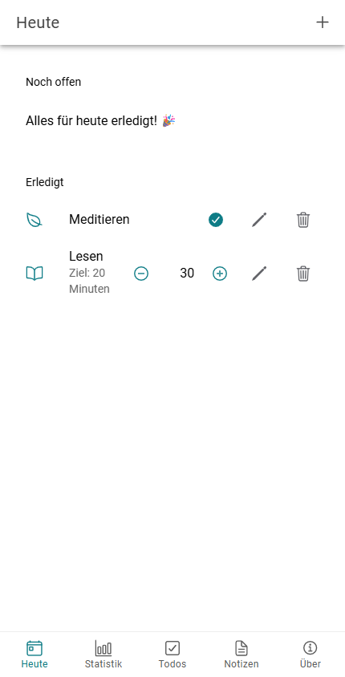

# Habitus

Habitus ist ein Habit-Tracker mit integrierter Todo-Liste und Notizen: Du legst die Gewohnheiten fest, die du regelmässig durchziehen willst, hakst sie täglich ab und siehst auf einen Blick, wie gut deine Woche oder dein Monat läuft — dazu eine einfache Liste für einmalige Aufgaben und frei formulierbare Notizen. Die App läuft als PWA im Browser und ist installierbar. Mit einem kostenlosen Konto (E-Mail/Passwort) synchronisieren sich deine Daten automatisch über Firebase zwischen all deinen Geräten; offline funktioniert die App weiterhin und synct bei Wiederverbindung.



Weitere Screenshots: [store/beschreibung.md](store/beschreibung.md).

## Status

Aktuelle Version: **v1.1.0** — alle fünf Tabs (Heute, Statistik, Todos, Notizen, Über) funktionieren mit echten Daten: Habits, Aufgaben und Notizen lassen sich frei anlegen, bearbeiten, abhaken/erledigen und löschen. Login/Registrierung per E-Mail/Passwort (Firebase Auth) schaltet die App frei; alle Daten werden pro Konto in Firestore synchronisiert und bleiben offline nutzbar. PWA-Installation und automatisches Deploy inklusive.

Live: TODO: URL des Deployments eintragen.

## Tech-Stack

| Technologie | Wofür |
| --- | --- |
| [Angular 22](https://angular.dev) | Applikations-Framework, Standalone Components und Signals |
| [Ionic 9](https://ionicframework.com) | UI-Komponenten und Tab-Navigation |
| [Firebase Auth](https://firebase.google.com/docs/auth) | E-Mail/Passwort-Login |
| [Firestore](https://firebase.google.com/docs/firestore) | Cloud-Sync der Nutzerdaten (`users/{uid}/...`), mit Offline-Persistenz |
| [Angular Service Worker](https://angular.dev/ecosystem/service-workers) | PWA: installierbar und offline-fähig |
| [Vitest](https://vitest.dev) | Unit-Tests (`ng test`, jsdom) |
| [ESLint](https://eslint.org) | Linting |
| GitLab CI/CD | Pipeline mit den Stages test, build und deploy |

## Projektstruktur

| Ordner | Inhalt |
| --- | --- |
| [`/projekt`](projekt/) | Die Angular-/Ionic-App inklusive [CHANGELOG](projekt/CHANGELOG.md) |
| [`/journal`](journal/journal.md) | Arbeitsjournal mit Entscheiden und Fortschritt |
| [`/store`](store/beschreibung.md) | Store-Beschreibung (Texte für die Veröffentlichung) |

Innerhalb von `/projekt/src/app`:

| Ordner | Inhalt |
| --- | --- |
| `core/services/` | `AuthService`, `MigrationService` und die Firestore-/Storage-Services (`Habit`, `Todo`, `Note`), App-Infos und Demo-Daten |
| `core/guards/` | `authGuard` — sperrt die Tabs für nicht eingeloggte Nutzer |
| `features/` | Je eine Page pro Tab: `today`, `stats`, `todos`, `notes`, `about`, dazu `auth` (Login/Registrierung) |
| `shared/components/` | Wiederverwendbare Bausteine (`habit-item`, `habit-progress`, `todo-item`, `demo-notice`) |
| `tabs/` | Tab-Bar, Tab-Konfiguration und Routing |

## Firebase-Konfiguration

Die App braucht ein eigenes Firebase-Projekt (Authentication mit aktiviertem
E-Mail/Passwort-Provider, Firestore-Datenbank). Die Config-Dateien mit den Zugangsdaten
sind gitignored, damit sie nicht versehentlich committet werden:

```bash
cd projekt/src/environments
cp environment.ts.example environment.ts
cp environment.prod.ts.example environment.prod.ts
```

Trage in beiden Dateien im `firebase`-Objekt die Werte aus der Firebase-Konsole ein
(Projekteinstellungen → Deine Apps → SDK-Setup und -Konfiguration).

In der CI-Pipeline gibt es diese Dateien nicht automatisch (sie sind gitignored) —
[`scripts/write-environment.mjs`](projekt/scripts/write-environment.mjs) erzeugt sie dort
aus der GitLab-CI-Variable `FIREBASE_CONFIG_JSON` (Settings → CI/CD → Variables, als
JSON der `firebaseConfig`, am besten *masked*).

Die Firestore Security Rules ([`projekt/firestore.rules`](projekt/firestore.rules)) lassen
sich per Firebase CLI deployen (kein Emulator nötig):

```bash
cd projekt
npx firebase-tools login
npx firebase-tools deploy --only firestore:rules
```

## Entwicklung

```bash
cd projekt
npm ci
npm start          # Dev-Server auf http://localhost:4200
npm run test:ci    # Unit-Tests einmalig ausführen
npm run lint       # Linting
npm run build      # Produktions-Build nach projekt/www
npm run serve:prod # Produktions-Build auf http://localhost:4400 ausliefern
npm run icons      # App-Icons aus dem SVG in scripts/generate-icons.mjs neu rendern
```

## PWA testen

Der Service Worker ist im Dev-Server bewusst deaktiviert (`enabled: !isDevMode()` in
[`src/main.ts`](projekt/src/main.ts)) — unter `localhost:4200` ist die App deshalb
**nicht** installierbar. Zum Testen der PWA braucht es den Produktions-Build:

```bash
npm run build
npm run serve:prod   # http://localhost:4400
```

Service Worker laufen nur in einem sicheren Kontext: `localhost` oder HTTPS. Über eine
reine `http://`-Adresse registriert sich der Worker nicht, und die App lässt sich dort
nicht installieren.

## Deployment

Die Pipeline in [`.gitlab-ci.yml`](.gitlab-ci.yml) läuft in drei Stages. Jeder Job, der
`npm ci` braucht, schreibt zuerst die Firebase-Config aus `FIREBASE_CONFIG_JSON` (siehe
[Firebase-Konfiguration](#firebase-konfiguration)):

1. **test** — `npm ci` und `npm run test:ci`
2. **build** — `npm run build` (Produktions-Build nach `projekt/www`)
3. **deploy** — Upload des Build-Ergebnisses auf den Webserver

Die Pipeline wird manuell über die GitLab-Weboberfläche gestartet (`workflow: rules` lässt nur `web`-Pipelines zu).

## Autor

David Roth
